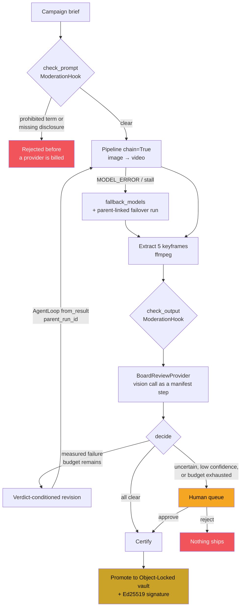
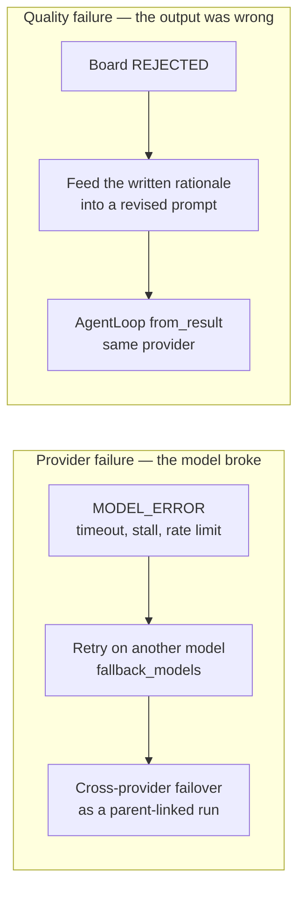

# Notary

**An AI Creative Review Board for generative media.**
_Every clip goes before the Board. Every approval is provable._

Built for the [Backblaze Generative Media Hackathon](https://backblaze-generative-media.devpost.com/) with **Genblaze** and **Backblaze B2**.

---

Marketing teams in regulated categories now generate dozens of AI video variants a week. Two things break at that volume: nobody consistently checks each output against the rules before it ships, and once it ships there is no reliable record of what produced it or who approved it. In pharma or financial services that second failure is not untidiness — it is the question a regulator asks first.

Notary puts a review board in front of every generated take. It **measures** what can be measured, **asks a model** only about what genuinely needs judgement, **revises** the clear failures using the reasons they failed, **escalates** anything ambiguous to a human, and **seals** what clears into Backblaze B2 under Object Lock with an Ed25519 signature.

It does not claim to replace a compliance reviewer. It turns "a person skims fifty takes" into "a person decides on the five the Board would not clear."

---

## The pipeline, above the fold

This is the actual orchestration, from [`backend/notary/pipeline/factory.py`](backend/notary/pipeline/factory.py):

```python
pipeline = Pipeline(f"notary-{brief.campaign_id}-take{iteration}", chain=True)
pipeline = pipeline.moderation(brand_guardrail_hook)      # deterministic screen

pipeline = pipeline.step(                                  # storyboard keyframe
    providers.image,
    model="seedream-5.0-lite",
    prompt=compose_storyboard_prompt(brief, guidance),
    modality=Modality.IMAGE,
    aspect_ratio=brief.channel.aspect_ratio,
)

pipeline = pipeline.step(                                  # chained image -> video
    providers.video,
    model="kling-image2video-v2.1-master",
    prompt=compose_video_prompt(brief, guidance),
    modality=Modality.VIDEO,
    duration=brief.channel.duration_seconds,
    aspect_ratio=brief.channel.aspect_ratio,
    fallback_models=["ray-2"],                             # provider resilience
)
```

…and the loop that drives it, from [`backend/notary/pipeline/runner.py`](backend/notary/pipeline/runner.py):

```python
loop = AgentLoop(
    pipeline_factory,                       # receives AgentContext, returns the Pipeline above
    CallableEvaluator(board_evaluator),     # the Board decides pass / revise / escalate
    max_iterations=3,
)
result = loop.run(sink=object_storage_sink, timeout=600)
```

`AgentLoop` calls `Pipeline.from_result(previous)` between iterations automatically, so **every revision carries `parent_run_id` back to the take it corrects**. The lineage graph in the UI is read straight out of those manifests — there is no separate database recording it.

---

## The one idea worth stealing

Most "AI reviews AI" demos hand a rubric to a vision model and print the score. That is the soft centre, and it is where a skeptical reviewer pushes.

Notary splits the rubric by **how a thing can be known**:

| | Measured | Reviewed |
|---|---|---|
| **Mechanism** | `ModerationHook`, pure computation | Vision model, wrapped as a `SyncProvider` |
| **Examples** | aspect ratio, duration, palette ΔE, prohibited terms, mandatory disclosure | logo legibility, generation artifacts, tone, prohibited depiction |
| **Output** | a number against a threshold | a verdict with a confidence |
| **Can it be wrong?** | No. It is arithmetic. | Yes, and it is allowed to be. |
| **On failure** | Reject and revise — the defect is real | Reject only if confident; otherwise escalate |
| **Reproducible by a third party?** | Yes, from the file alone | No |

A palette rejection reads `coverage 0% · min 55% · dE 111.5`. That is a measurement of 78,436 chromatic pixels in CIE L\*a\*b\* space, and anyone holding the file can recompute it without trusting Notary at all. An artifact finding reads `0.38` on a confidence bar and goes to a human, because a model that is 38% sure should not be spending your render budget.

The interface makes this visible: measured findings render as instrument readouts, judged findings render with confidence bars. **You can tell facts from opinions without reading a word.**

---

## What happens to a brief



The three terminal states are deliberate. **Certified**, **rejected**, and **waiting on a person** — there is no fourth path where something ambiguous quietly ships.

---

## Two kinds of failure, two different remedies

Collapsing these into one retry is the tell of a shallow integration, so Notary keeps them apart in code, in the event stream, and in the UI.



A missing logo is not fixed by switching providers — a different model renders the same non-compliant brief just as non-compliantly. The defect is in the prompt, so the prompt is what changes. Conversely a stalled provider is not fixed by rewriting the prompt.

---

## Trust: what is actually claimed

Genblaze's `docs/features/trust-modes.md` defines three levels and ships one:

| Mode | What it proves | Status in the SDK | Status in Notary |
|---|---|---|---|
| 1 — Integrity | The manifest is unchanged and assets match their hashes | Shipped | ✅ Used |
| 2 — Authenticated integrity | *Who* attested to it (Ed25519) | Roadmap | ✅ **Implemented** |
| 3 — Standards-verifiable | C2PA, verifiable by Adobe/Microsoft tooling | Roadmap | ❌ Not implemented |

Mode 1's limitation is stated plainly in the SDK's own docs: *"A tamperer can modify the asset, recompute the manifest, re-embed, and produce a manifest that verifies against itself."*

The SDK also leaves the door open: *"The `signature` and `encryption_scheme` fields on `Manifest` are reserved (excluded from the canonical hash) for forward compatibility."*

Notary fills that field in. Because the field is excluded from the canonical hash, a signature can be written into the manifest without invalidating the hash it commits to:

1. Genblaze computes `canonical_hash` over the manifest, signature excluded
2. Notary signs those hash bytes with Ed25519
3. The signature goes into the reserved field
4. `canonical_hash` is unchanged
5. A verifier recomputes the hash, then checks the signature over it

**What Notary says:** tamper-evident, immutable under Object Lock, and signed by a named key.
**What Notary does not say:** that the media is real, that the model behaved, or that the signing key cannot be stolen. Key custody is the trust anchor and in this deployment it is a local PEM file — fine for a demo, not for production. See [docs/TRUST-MODEL.md](docs/TRUST-MODEL.md).

---

## Prove it yourself

Three claims in this README are testable in under a minute each, without taking our word for anything.

**1. The Board cannot certify something unsafe.** `decide()` has a finite input space, so it is not sampled — it is enumerated completely.

```bash
python scripts/evaluate_board.py
#   palette_adherence    n=25  precision=100.0%  recall=100.0%  accuracy=100.0%
#   safety invariant   : 536,424 combinations -> HOLDS
#   budget invariant   :       7 combinations -> HOLDS
```

Across **536,424 combinations** of criterion outcome, check kind, severity, confidence band, and remaining revision budget, there is no input on which Notary certifies an asset that a blocking criterion failed or could not resolve. That is a property of the decision function, not an estimate of its behaviour — a stronger statement than any accuracy score. Results: [docs/EVALUATION.md](docs/EVALUATION.md), also served in the app under **Evidence**.

**2. A certificate can be verified without Notary.** This script imports nothing from this codebase — standard library plus `cryptography`:

```bash
python scripts/verify_certificate.py path/to/certificate.json
```

It downloads the media from B2, recomputes SHA-256 over the bytes that actually arrive, verifies the Ed25519 signature over the canonical manifest hash, and reports the retention window. A provenance claim only checkable by the system that made it is not a provenance claim.

**3. The seal actually catches tampering.** Four real attacks against a real signed certificate:

```bash
python scripts/tamper_demo.py
#   Swap the certified video           caught
#   Rewrite the sealed verdict         caught
#   Forge with a different key         caught
#   Re-sign with a stolen key          not caught
```

The fourth is included deliberately. A stolen private key defeats any signature scheme, and a security demo that only shows its wins is marketing. What constrains that attacker is Object Lock — they can mint a new record, but they cannot revise the sealed one.

---

## Storage: why B2 is not swappable here

```
vault/{tenant}/{campaign}/{asset_id}/     ← Object Lock COMPLIANCE
    asset.mp4          the media, manifest embedded
    manifest.json      provenance, canonical-hashed
    verdict.json       the Board's full finding + human sign-off
    certificate.json   the signed envelope
    thumbnail.jpg

workbench/{tenant}/{run_id}/              ← no lock, Lifecycle-expired
    take-01.mp4, take-01/frame-00.jpg …   drafts and rejected takes

cache/{sha[0:2]}/{sha[2:4]}/{sha}.ext     ← content-addressable, dedup
```

Three prefixes, three deliberate strategies:

- **Vault is hierarchical** because the query that matters is an audit request. "Everything Acme certified for the Q3 campaign" is a prefix listing, and one asset's complete sealed record — media, provenance, verdict, signature — comes back as a single unit.
- **Workbench is run-scoped** because everything for a run expires together, which makes the Lifecycle Rule a prefix age rule that cannot orphan bytes. Rejected takes lose their media and **keep their verdict**, so "why was this rejected?" outlives the file.
- **Cache is content-addressable** so identical bytes deduplicate and an unchanged brief costs a HEAD request instead of a Kling render.

**The load-bearing part is Object Lock.** Compliance-mode retention is enforced by storage, not by application logic: once written, an object cannot be altered or deleted before its retention date by anyone — not an admin, not the account owner, not someone holding stolen keys. That is what turns "we keep a record" into "the record cannot be revised after the fact," which is the entire premise of an audit trail. It also cannot be retrofitted, which is why [`scripts/bootstrap_b2.py`](scripts/bootstrap_b2.py) creates the bucket with it enabled and refuses to continue if it is not.

The verdict is sealed under the same retention as the asset, so "is the approval part of the immutable record?" has the answer **yes**.

Full detail: [docs/B2-AND-GENBLAZE.md](docs/B2-AND-GENBLAZE.md).

---

## Run it

Replay mode needs **no credentials, no API keys, and no SDK** — a fresh clone works.

```bash
git clone <repo> && cd notary

python -m venv .venv && source .venv/bin/activate   # Windows: .venv\Scripts\activate
pip install -e "backend[dev]"

python scripts/seed_demo.py                          # generate demo recordings
uvicorn notary.main:app --app-dir backend --reload    # http://localhost:8000

cd frontend && npm install && npm run dev             # http://localhost:5173
```

Open the app and press **Watch the review** on the first recording. You will see the checklist resolve criterion by criterion, a real palette failure at ΔE 95.7, a verdict-conditioned revision, and the corrected take clear at ΔE 3.8.

### Live mode

```bash
cp .env.example .env      # fill in B2 + GMI Cloud credentials
python scripts/bootstrap_b2.py    # creates buckets, Object Lock, lifecycle, CORS
python scripts/generate_key.py    # Ed25519 signing key for Trust Mode 2
NOTARY_MODE=live uvicorn notary.main:app --app-dir backend
```

`ffmpeg` must be on PATH for keyframe extraction. If it is missing, visual criteria report `UNCERTAIN` and escalate to a human rather than silently passing.

### Tests

```bash
cd backend && pytest -q      # 47 tests, no credentials required
```

The suite concentrates on the invariants that must never break: a malformed model response cannot produce a pass, an exhausted revision budget cannot become an approval, a missing measurement escalates rather than assumes, and a signature from the wrong key is rejected.

---

## Repository map

| Path | What lives there |
|---|---|
| [`backend/notary/board/`](backend/notary/board/) | The Board. `deterministic.py` (colour science, measurements), `moderation.py` (the `ModerationHook`), `review.py` (vision as a `SyncProvider` + `decide()`), `evaluator.py` (the `AgentLoop` bridge), `rubric.py` (compliance profiles) |
| [`backend/notary/provenance/`](backend/notary/provenance/) | `signing.py` (Ed25519, Trust Mode 2), `certificate.py`, `verify.py` (re-hash from B2) |
| [`backend/notary/storage/`](backend/notary/storage/) | `b2.py` (Object Lock, lifecycle, CORS), `keys.py` (the three key strategies) |
| [`backend/notary/pipeline/`](backend/notary/pipeline/) | `factory.py` (the Pipeline), `runner.py` (orchestration, two-tier failure model) |
| [`backend/notary/evaluation/`](backend/notary/evaluation/) | `corpus.py` (constructed ground truth), `harness.py` (scoring + the exhaustive safety proof) |
| [`backend/notary/genblaze_compat.py`](backend/notary/genblaze_compat.py) | Every SDK assumption, in one auditable place |
| [`frontend/src/components/Findings.tsx`](frontend/src/components/Findings.tsx) | The measured/reviewed split, rendered |
| [`docs/`](docs/) | Architecture, providers, B2+Genblaze, trust model, spikes, operations |

---

## Documentation

- [**PROVIDERS.md**](docs/PROVIDERS.md) — every AI provider and model used, and why
- [**B2-AND-GENBLAZE.md**](docs/B2-AND-GENBLAZE.md) — exactly how the app uses both
- [**ARCHITECTURE.md**](docs/ARCHITECTURE.md) — the deep version, with sequence diagrams
- [**TRUST-MODEL.md**](docs/TRUST-MODEL.md) — what is proven, what is not, and the threat model
- [**EVALUATION.md**](docs/EVALUATION.md) — measured accuracy, the exhaustive safety proof, and what is *not* measured (generated, never hand-written)
- [**SPIKES.md**](docs/SPIKES.md) — the SDK questions resolved before designing around them
- [**OPERATIONS.md**](docs/OPERATIONS.md) — deployment, key custody, scaling, runbook

---

## Honest limitations

Stated here rather than discovered by a reviewer:

- **The signing key is a local file.** Anyone who reads it can issue certificates in this deployment's name. Production belongs in a KMS. Mode 2 authenticates a key, not a company.
- **The perceptual half is not calibrated.** The *measured* half is scored at 100% precision and recall against a corpus with constructed ground truth, and the decision function is exhaustively proven safe — but the five perceptual criteria (logo legibility, artifacts, tone, prohibited depiction, logo presence) carry **no accuracy claim at all**. Scoring them honestly needs real generated video and independent human labels; synthesising them would measure our own assumptions. The harness is built and waiting for labelled data — see [docs/EVALUATION.md](docs/EVALUATION.md), which states this gap with the same prominence as the wins. This is precisely why perceptual uncertainty escalates to a human rather than resolving automatically.
- **The event bus is in-process.** Correct for one node, wrong for a horizontally scaled deployment. The interface is a drop-in for Redis pub/sub.
- **Cross-provider `fallback_models` is undocumented** in the SDK, so Notary does not depend on it — it catches the terminal provider fault and launches a parent-linked run on the second provider instead. See [docs/SPIKES.md](docs/SPIKES.md) #2.
- **The pharma and financial profiles are screening rubrics, not statutory review.** They catch the mechanical failures that waste a reviewer's time. They do not adjudicate whether a claim is substantiated, and they say so.
- **C2PA (Trust Mode 3) is not implemented.** It is listed as roadmap and not claimed anywhere in the interface.

---

## Roadmap

Mode 3 / C2PA embedding · KMS-backed signing with key rotation · B2 Event Notifications driving downstream workers instead of in-process orchestration · a labelled evaluation set with published precision and recall per criterion · `ParquetSink` analytics for cost and escalation rate by provider.

---

MIT. Built with [Genblaze](https://github.com/backblaze-labs/genblaze) on [Backblaze B2](https://www.backblaze.com/cloud-storage).
