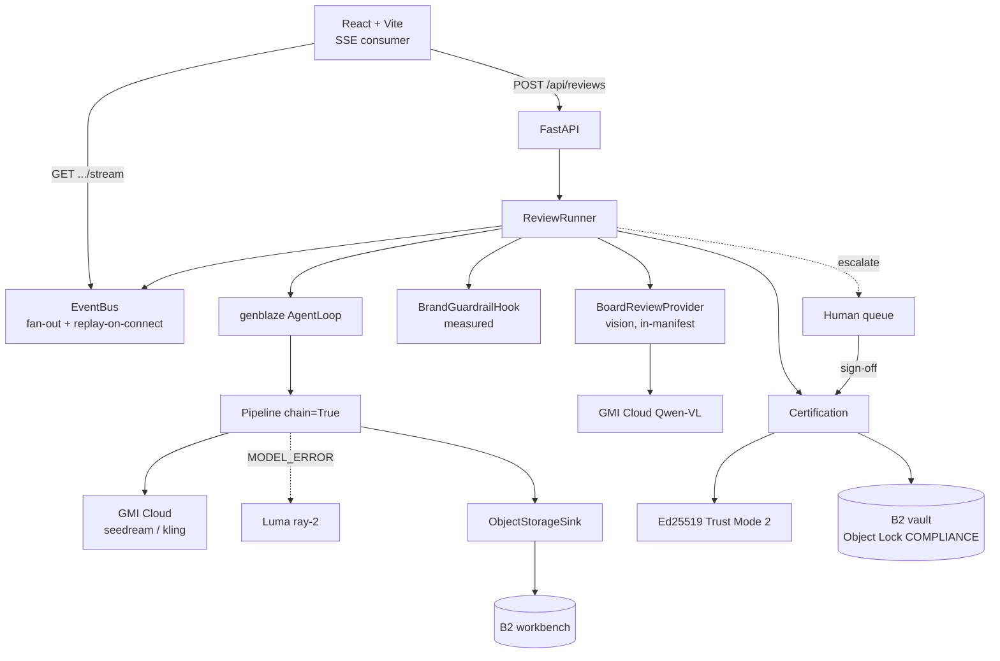
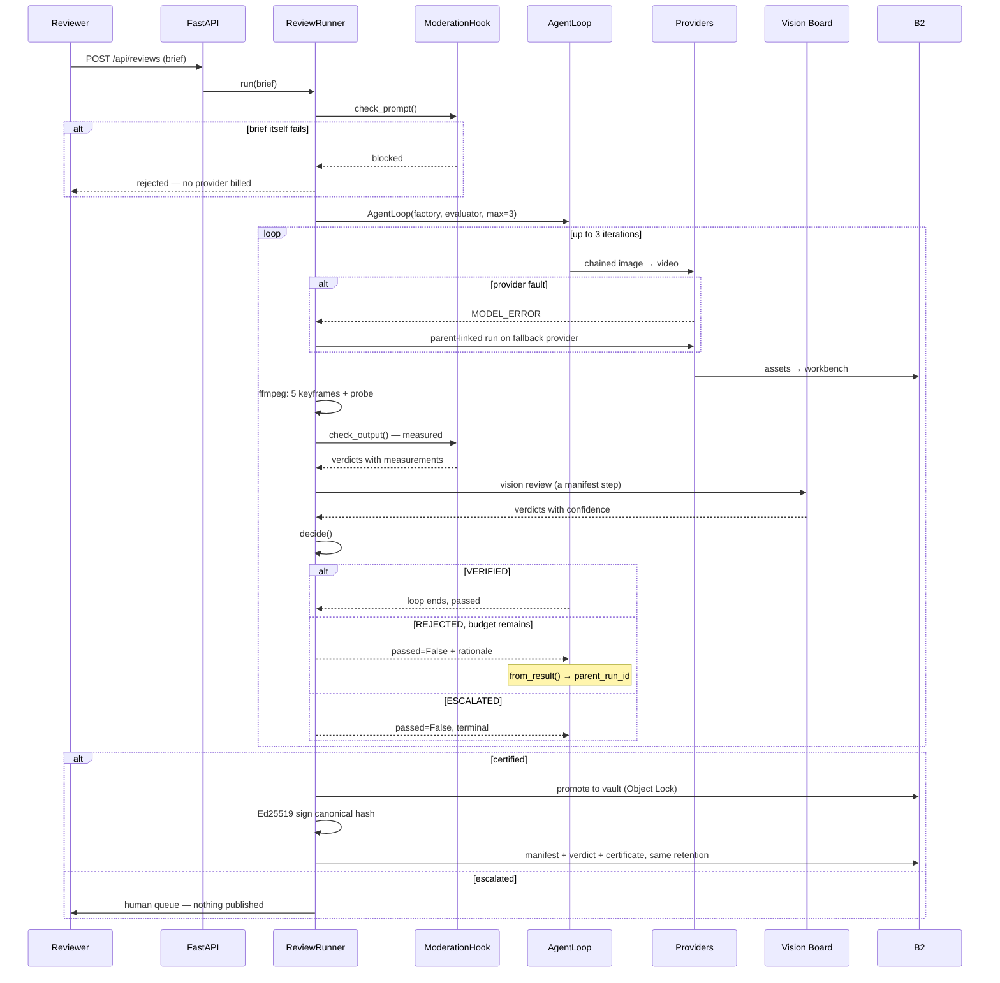

# Architecture

## Shape

One FastAPI process plus Backblaze B2. No database, no broker, no worker fleet.

That is possible because Genblaze is library-only and stateless — a pipeline is constructed and executed inside a request handler — and because B2 holds all durable state. The in-process store is a cache over the vault, and [`store.rehydrate_from_b2()`](../backend/notary/store.py) rebuilds it on startup by listing the bucket.

---

## One review, end to end

---

## Why the rubric is split by epistemology

The central design decision. Each criterion declares itself `DETERMINISTIC` or `PERCEPTUAL`, and they are enforced by different machinery because they are different *kinds of claim*.

A measured failure is a fact: reproducible from the file alone, by anyone, without trusting Notary. A perceptual failure is an opinion: useful, actionable, and permitted to be wrong.

Consequences that fall out of taking this seriously:

- Measured failures **outrank** perceptual passes. When a measurement and a model disagree, the measurement wins (`test_measured_failure_outranks_a_confident_perceptual_pass`).
- Measured criteria carry `measurement`, never `confidence`. A measurement has a value, not a probability.
- Perceptual criteria carry `confidence`, and below 0.55 a failure **escalates instead of revising** — spending a render on a guess is worse than asking a person.
- The UI renders them differently, so a reviewer can tell facts from opinions without reading.

## `decide()` precedence

From [`board/review.py`](../backend/notary/board/review.py), strictest first:

1. Measured blocking failure → **REJECTED** (revise) — it is real and prompt-fixable
2. Any blocking `UNCERTAIN` → **ESCALATED** — ambiguity never ships
3. Low-confidence perceptual failure → **ESCALATED**
4. Confident perceptual failure → **REJECTED** if budget remains, else **ESCALATED**
5. Otherwise → **VERIFIED**

The rule underneath all of it: **there is no path where degraded conditions produce a pass.** A malformed model response, an unrun check, a missing frame, an exhausted budget — every one escalates. That is asserted directly in [`tests/test_board.py`](../backend/tests/test_board.py).

---

## Sealing the verdict, twice

The verdict reaches the immutable record by two routes, and the redundancy is intentional:

| Route | Bound by | Strength | Weakness |
|---|---|---|---|
| Manifest — moderation findings in step metadata, vision verdict as a content-addressed asset | The canonical hash, and the signature over it | Cryptographic | Terse |
| `verdict.json` in the vault | Object Lock retention | Complete, human-readable, includes measurements and sign-off | Relies on storage immutability |

Each covers the other's weakness. "Is the approval part of what you sealed?" — yes, both ways.

---

## Replay

Every live run writes its event stream to `seed/<session>/events.ndjson`. Replaying one publishes those events into the same bus, under a fresh session id, consumed by the same SSE endpoint and the same frontend code path. The only difference anywhere is a `replayed: true` flag, which the interface **surfaces rather than hides** — a provenance product that passed a recording off as a live render would be undermining its own thesis.

One mechanism, four benefits: a judge reaches the hero moment in seconds; frontend work costs no credits; the demo cannot fail live; CI gets a fixture for the SSE contract.

Timing is compressed 3× and gaps clamped to 2.5s, because faithfully reproducing a 90-second provider stall is faithful to the wrong thing.

---

## Evaluating the Board

Implemented in [`backend/notary/evaluation/`](../backend/notary/evaluation/); results in [EVALUATION.md](EVALUATION.md), regenerated by `python scripts/evaluate_board.py` and served at `/api/evaluation`.

**The measured half is scored.** Ground truth is *constructed* rather than labelled: a frame built from a known on-palette fraction has a known correct answer, so no human labelling is needed. The corpus concentrates two-thirds of its samples within ±10% of a decision threshold, because a threshold classifier can only be wrong near its threshold — a corpus of obvious cases would report ~100% and mean nothing. Current result: 100% precision and recall across all four measured criteria, 32 samples.

**The decision function is proven, not sampled.** `decide()`'s input space is finite — a handful of criteria, each in one of four outcomes, crossed with check kind, severity, confidence band, and remaining budget. So it is enumerated exhaustively. Across **536,424 combinations**, no input produces `VERIFIED` when a blocking criterion failed or could not be resolved. A second search confirms an exhausted revision budget never becomes an approval.

That second result is the stronger one. Precision says the classifier is usually right; exhaustive enumeration says *there is no input on which the system certifies something it should not have*. For a compliance gate, the second property is the one that matters, and it is provable rather than estimated.

**The perceptual half is deliberately unscored.** Judging logo legibility or generation artifacts honestly requires real generated video and independent human labels. Synthesising them would measure our own assumptions rather than the Board, so `evaluate()` reports the gap as a first-class result rather than quietly scoring the tractable half and presenting it as "the Board's accuracy."

To close it: assemble 30–50 real takes spanning pass, fail, and genuinely ambiguous; have two reviewers label each criterion independently and record inter-rater agreement (which upper-bounds any achievable score); run the harness; tune the 0.55 confidence floor against the escalation rate a real team would tolerate; publish the table including the criteria it does badly on.

The metric that matters is **recall on blocking criteria** — a missed violation ships, a false alarm costs one render. The floor should make the first error rare, accepting more of the second.

---

## Deliberate limits

- **In-process event bus.** Correct for one node; a second instance would not see the first's events. The `EventBus` interface is a drop-in for Redis pub/sub.
- **In-memory session state.** Durable state is in B2; an in-flight run does not survive restart, and the SSE stream terminates visibly rather than hanging.
- **Local signing key.** See [TRUST-MODEL.md](TRUST-MODEL.md).
- **Synchronous SDK on a thread.** Renders block for minutes, so `AgentLoop` runs via `asyncio.to_thread` and events cross back with `run_coroutine_threadsafe`. Running it on the event loop would freeze every SSE stream in the process.
